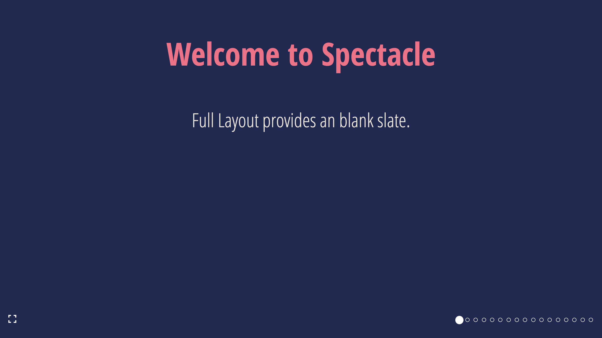
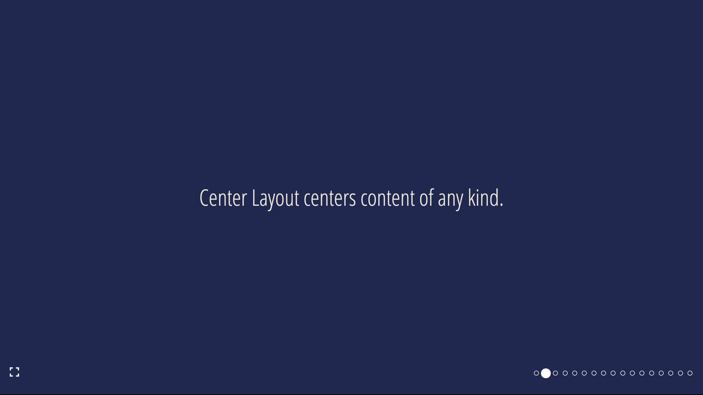
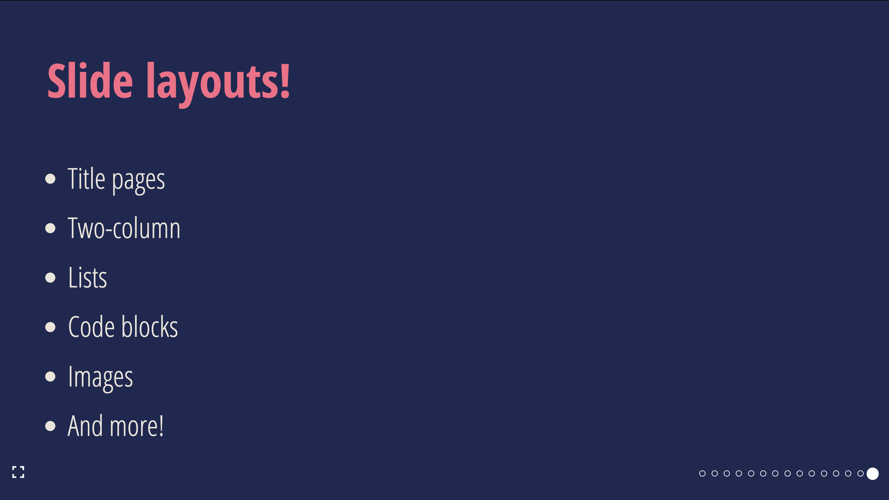
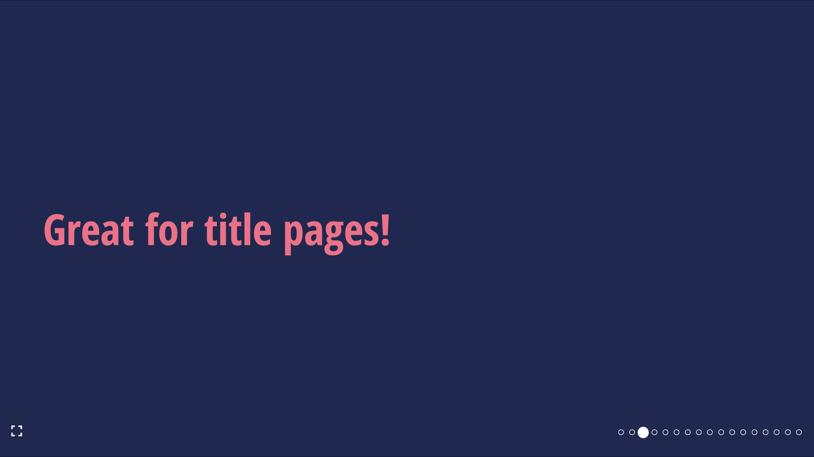
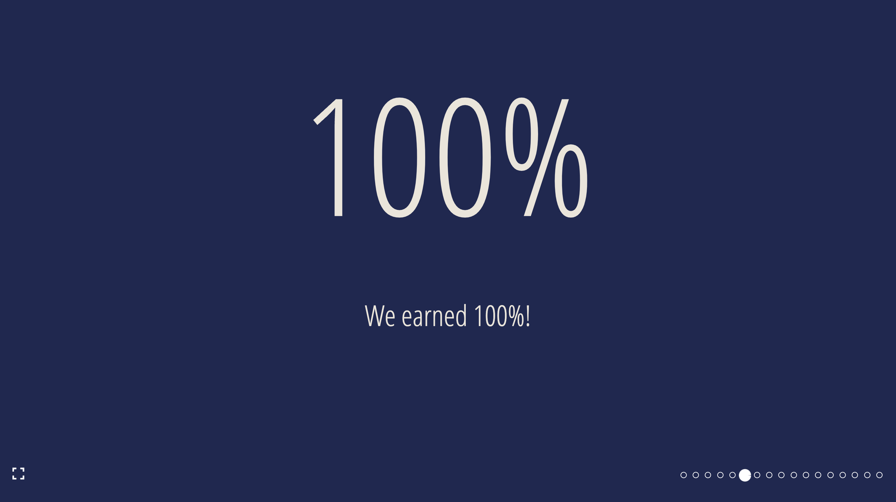
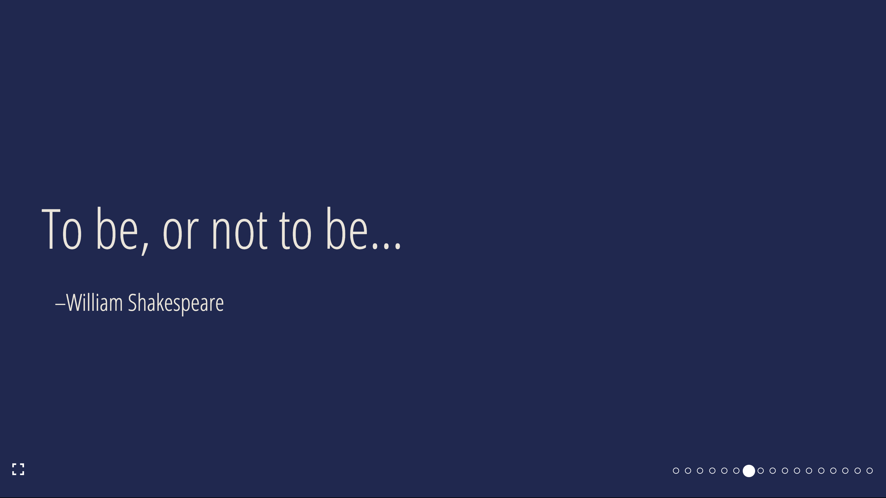
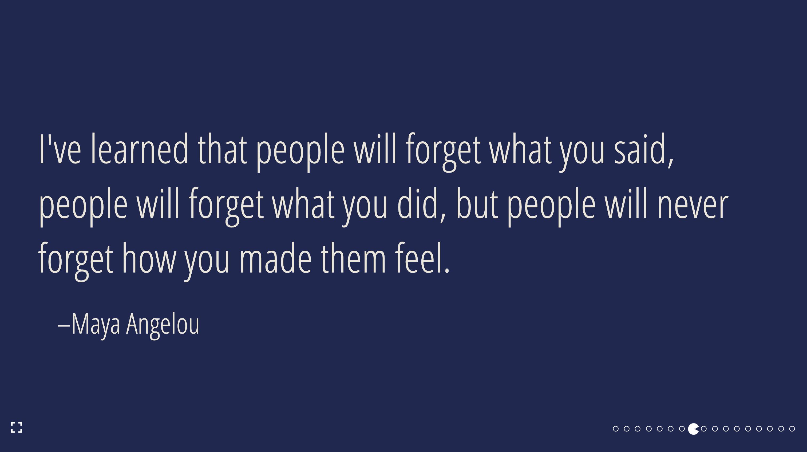
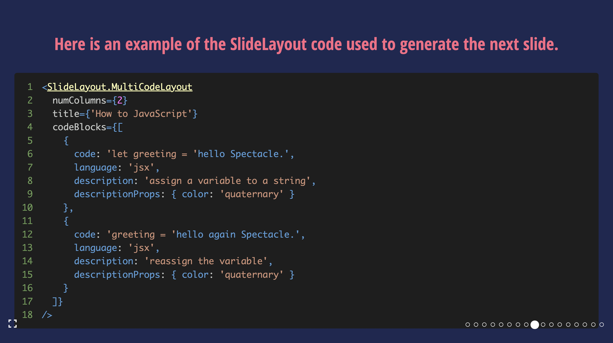
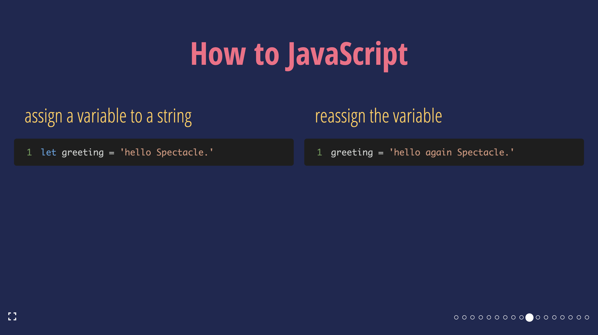
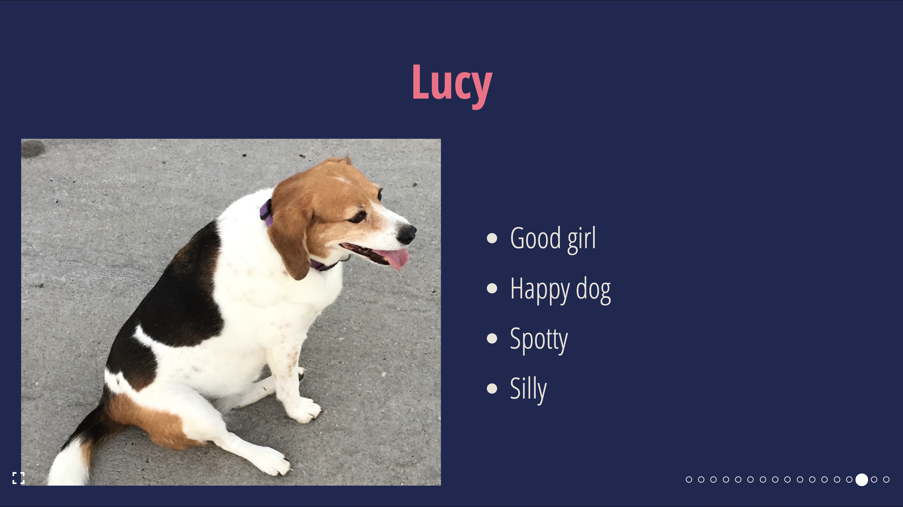

import Full from '../website/static/img/slide-layouts/full.png';


## SlideLayout

`SlideLayout` is a set of helper components used to create slides from a set of pre-defined layouts, so you can avoid dealing with things like layout primitives.

### `SlideLayout.Full`

A full-slide layout

| Props           | Type                  | Example |
|-----------------|-----------------------|---------|
| `...slideProps` | [Slide Props](#slide) |         |



### `SlideLayout.Center`

A layout with centered content

| Props           | Type                  | Example |
|-----------------|-----------------------|---------|
| `...slideProps` | [Slide Props](#slide) |         |



### `SlideLayout.TwoColumn`

A layout with two columns

| Props           | Type                  | Example                          |
|-----------------|-----------------------|----------------------------------|
| `...slideProps` | [Slide Props](#slide) |                                  |
| `left`          | `ReactNode`           | `<Heading>Left</Heading>` |
| `right`         | `ReactNode`           | `<Heading>Right</Heading>` |

 

### `SlideLayout.List`

A layout with a list and an optional title

| Props              | Type                                | Required | Example                         |
|--------------------|-------------------------------------|----------|---------------------------------|
| `...slideProps`    | [Slide Props](#slide)               | ❌        |                                 |
| `items`            | `ReactNode[]`                       | ✅        | `['Hello', <Text>World</Text>]` |
| `title`            | `string`                            | ❌        | `My list slide`                 |
| `titleProps`       | [Heading Props](./props/#typograph) | ❌        | `{ color: 'red' }`              |
| `animateListItems` | `boolean`                           | ❌        | `true`                          |
| `listProps`        | [List Props](#typography-tags)      | ❌        | `{ backgroundColor: 'purple' }` |



### `SlideLayout.Section`

A layout with a section title

| Props                  | Type                            | Required |  Example                 |
|------------------------|---------------------------------|----------|--------------------------|
| `...slideProps`        | [Slide Props](#slide)           | ❌        |                          |
| `sectionProps`         | [Text Props](#typography-tags)  | ❌        | { fontSize: "48px" }     |



### `SlideLayout.Statement`

A layout with a centered statement

| Props                  | Type                            | Required |  Example                 |
|------------------------|---------------------------------|----------|--------------------------|
| `...slideProps`        | [Slide Props](#slide)           | ❌        |                          |
| `statementProps`       | [Text Props](#typography-tags)  | ❌        | { fontSize: "48px" }     |


### `SlideLayout.BigFact`

A layout to present a fact in large font

| Props                  | Type                           | Required | Example               | Default |
|------------------------|--------------------------------|----------|-----------------------|---------|
| `children`             | `ReactNode`                    | ✅        | `100%`                |         |
| `...slideProps`        | [Slide Props](#slide)          | ❌        |                       |         |
| `factInformation`      | `ReactNode`                    | ❌        | `Fact information`    |         |
| `factProps`            | [Text Props](#typography-tags) | ❌        | { fontSize: "100px" } |         |
| `factInformationProps` | [Text Props](#typography-tags) | ❌        | { fontSize: "48px" }  |         |
| `factFontSize`         | `string`                       | ❌        | `150px`               | `250px` |



### `SlideLayout.Quote`

A quote and attribution layout

| Props              | Type                           | Required | Example               |
|--------------------|--------------------------------|----------|-----------------------|
| `...slideProps`    | [Slide Props](#slide)          | ❌        |                       |
| `children`         | `ReactNode`                    | ✅        | `To be, or not to be` |
| `attribution`      | `ReactNode`                    | ✅        | `William Shakespeare` |
| `quoteProps`       | [Text Props](#typography-tags) | ❌        | { fontSize: "100px" } |
| `attributionProps` | [Text Props](#typography-tags) | ❌        | { fontSize: "48px" }  |




### `SlideLayout.Code`

A layout with a single code pane and an optional title

| Props           | Type                              | Required | Example                                                          |
|-----------------|-----------------------------------|----------|------------------------------------------------------------------|
| `...slideProps` | [Slide Props](#slide)             | ❌        |                                                                  |
| `children`      | `string`                          | ✅        | `const Component = (props: componentProps): JSX.Element = {...}` |
| `language`      | `boolean`                         | ✅        | `false`                                                          |
| `title`         | `string`                          | ❌        | `Show me the code!`                                              |
| `titleProps`    | [Heading Props](#typography-tags) | ❌        | `{ color: 'red' }`                                               |
| `codePaneProps` | `CodePaneProps`                   | ❌        |                                                                  |



### `SlideLayout.MultiCodeLayout`

A layout with more than one code block: multiple code panes with optional descriptions, and an optional slide title.

| Props           | Type                              | Required | Example                                                                                                             |
|-----------------|-----------------------------------|----------|---------------------------------------------------------------------------------------------------------------------|
| `...slideProps` | [Slide Props](#slide)             | ❌        |                                                                                                                     |
| `codeBlocks`    | `CodeBlock[]`                     | ✅        | `[{ code: 'console.log("hello world!")', language: 'jsx', description: 'Say hello', codePaneProps: {...} }, {...}]` |
| `title`         | `string`                          | ❌        | `Show me the code!`                                                                                                 |
| `titleProps`    | [Heading Props](#typography-tags) | ❌        | `{ color: 'red' }`                                                                                                  |
| `numColumns`    | `number`                          | ❌        | `{2}`                                                                                                               |

where

```ts
type CodeBlock = Omit<CodePaneProps, 'children'> & {
  code: CodePaneProps['children'];
  description?: string | ReactNode;
  descriptionProps?: ComponentProps<typeof Text>;
}
```



### `SlideLayout.HorizontalImage`

A layout with one image per slide: a horizontal/landscape image and an optional title or description.
[alt text](https://developer.mozilla.org/en-US/docs/Web/API/HTMLImageElement/alt)

| Props               | Type                                    | Required | Example                                                          |
|---------------------|-----------------------------------------|----------|------------------------------------------------------------------|
| `...slideProps`     | [Slide Props](#slide)                   | ❌        |                                                                           |
| `src`               | `string`                                | ✅        | `https://raw.githubusercontent.com/FormidableLabs/dogs/main/src/fred.jpg` |
| `alt`               | `string`                                | ✅        | `Fred the dog looking at the camera`                                      |
| `imgProps`          | `ImgHTMLAttributes<HTMLImageElement>`   | ❌        | `{ style: { objectFit: 'contain' } }`                                     |
| `imgContainerProps` | `ComponentProps<typeof FlexBox>`        | ❌        | `{ style: { border: '8px solid white' } }`                                |
| `title`             | `string | ReactNode`                    | ❌        | `Fred is a 100% pure bred good boy!`                                      |
| `titleProps`        | [Text Props](#typography-tags)          | ❌        | `{ color: 'red' }`                                                        |
| `description`       | `string | ReactNode`                    | ❌        | `and we love him`                                                         |
| `descriptionProps`  | [Text Props](#typography-tags)          | ❌        | `{ color: 'white' }`                                                      |


### `SlideLayout.VerticalImage`

A layout with one image per slide: a vertical/portrait image with a bulleted list and an optional title.
[alt text](https://developer.mozilla.org/en-US/docs/Web/API/HTMLImageElement/alt)

| Props               | Type                                                              | Required | Example                                                          |
|---------------------|-------------------------------------------------------------------|----------|------------------------------------------------------------------|
| `...slideProps`     | [Slide Props](#slide)                                             | ❌        |                                                                           |
| `src`               | `string`                                                          | ✅        | `https://raw.githubusercontent.com/FormidableLabs/dogs/main/src/fred.jpg` |
| `alt`               | `string`                                                          | ✅        | `Fred the dog looking at the camera`                                      |
| `imgProps`          | `ImgHTMLAttributes<HTMLImageElement>`                             | ❌        | `{ style: { objectFit: 'contain' } }`                                     |
| `imgContainerProps` | `ComponentProps<typeof FlexBox>`                                  | ❌        | `{ style: { border: '8px solid white' } }`                                |
| `position`          | `right` | `left`                                                  | ❌        | `right`                                                                   |
| `title`             | `string | ReactNode`                                              | ❌        | `Fred is a 100% pure bred good boy!`                                      |
| `titleProps`        | [Text Props](#typography-tags)                                    | ❌        | `{ color: 'red' }`                                                        |
| `listItems`         | `ReactNode[]`                                                     | ❌        | `['brown hair', 'brown eyes', 'happy boy']`                               |
| `animateListItems`  | `boolean`                                                         | ❌        | `true`                                                                    |
| `listType`          | `ordered` | `unordered`                                           | ❌        | `unordered`                                                               |
| `listProps`         | `ComponentProps<typeof UnorderedList & typeof OrderedList>`       | ❌        | `{ color: 'white' }`                                                      |




### `SlideLayout.ThreeUpImage`

A layout with three images per slide: a primary, a top and bottom images.
[alt text](https://developer.mozilla.org/en-US/docs/Web/API/HTMLImageElement/alt)

| Props               | Type                                              | Required | Example                                                          |
|---------------------|---------------------------------------------------|----------|------------------------------------------------------------------|
| `...slideProps`     | [Slide Props](#slide)                             | ❌        |                                                                 |
| `primary`           | `ImagePane & { position?: 'right' | 'left'; }`    | ✅        | `{src: 'https://raw.githubusercontent.com/FormidableLabs/dogs/main/src/fred.jpg', alt: 'Fred the dog looking at the camera' }` |
| `top`               | `ImagePane`                                       | ✅        | `{src: 'https://raw.githubusercontent.com/FormidableLabs/dogs/main/src/fred.jpg', alt: 'Fred the dog looking at the camera' }` |
| `bottom`            | `ImagePane`                                       | ✅        | `{src: 'https://raw.githubusercontent.com/FormidableLabs/dogs/main/src/fred.jpg', alt: 'Fred the dog looking at the camera' }` |

where

```ts
type ImagePane = {
  src: string;
  alt: string;
  imgProps?: React.ImgHTMLAttributes<HTMLImageElement>;
  imgContainerProps?: ComponentProps<typeof FlexBox>;
}
```


### `SlideLayout.FullBleedImage`

A layout with an image that covers the entire slide.
[alt text](https://developer.mozilla.org/en-US/docs/Web/API/HTMLImageElement/alt)

| Props               | Type                                    | Required | Example                                                          |
|---------------------|-----------------------------------------|----------|------------------------------------------------------------------|
| `...slideProps`     | [Slide Props](#slide)                   | ❌        |                                                                           |
| `src`               | `string`                                | ✅        | `https://raw.githubusercontent.com/FormidableLabs/dogs/main/src/fred.jpg` |
| `alt`               | `string`                                | ✅        | `Fred the dog looking at the camera`                                      |
| `imgProps`          | `ImgHTMLAttributes<HTMLImageElement>`   | ❌        | `{ style: { objectFit: 'contain' } }`                                     |
| `imgContainerProps` | `ComponentProps<typeof FlexBox>`        | ❌        | `{ style: { border: '8px solid white' } }`  

